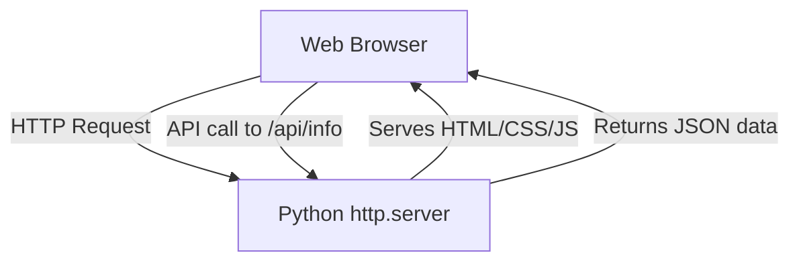

# Architecture Overview

This document describes the high-level architecture of **My Demo App**.

## Architecture Diagram

## Components

### 1. Frontend
- Single-page application served directly from the Python backend.
- Uses Vanilla HTML/CSS/JS for structure, design, and interactive behaviors.
- Integrates with the backend using the standard `fetch` API.

### 2. Backend
- Built using Python's standard library (`http.server` and `socketserver`).
- Listens on port `8000`.
- Implements simple path-based routing:
  - Serves static page for `GET /`.
  - Serves dummy JSON dataset for `GET /api/info`.
